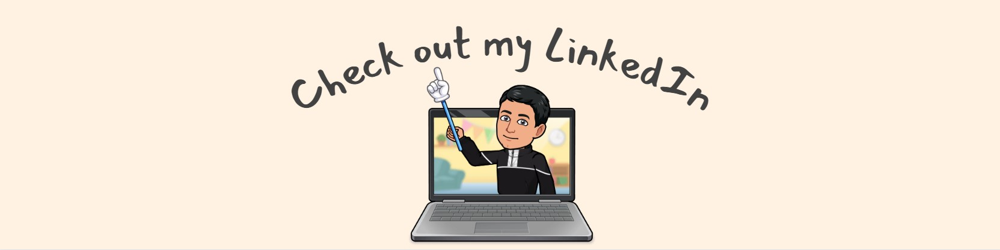

<h3 align="center">Currently pursuing an honours of Computer Science Degree</h3>

<h2>👋 About Me</h2>

I am a quick learner, adaptable, and have a strong work ethic. I am also a team player and am able to work effectively with others. I am passionate about my work and always strive to achieve the best results. I am looking for opportunities to grow and develop my skills further.

  
 

- 🎓 I am a 2nd year Computer Science student at **York University**
- 📍 I am from Beirut, **Lebanon**
- ⚡ In my free time, i solve problems on Leetcode and read tech articles
- 📫 How to reach me **ghassandaj@gmail.com**
- ⚡ Fun fact **I Speak 3 languages fluently**

<h2>🛠 Skills</h2>

 
  <code>IDE</code>
  

- Eclipse

- Visual Studio Code

- Android Studio 

  
 

 
  <code>Front-End</code>
  

- HTML 5

- CSS

- Javascript

 
  <code>Back-End</code>
  

- Java

- Python

 
  <code>Other Programming Languages</code>
  

- C

- C++

- Shell Scripting

- Assembly

<h2>📊Github Stats</h2>

&nbsp;

## 📧 Contact Me 

 

  
 

